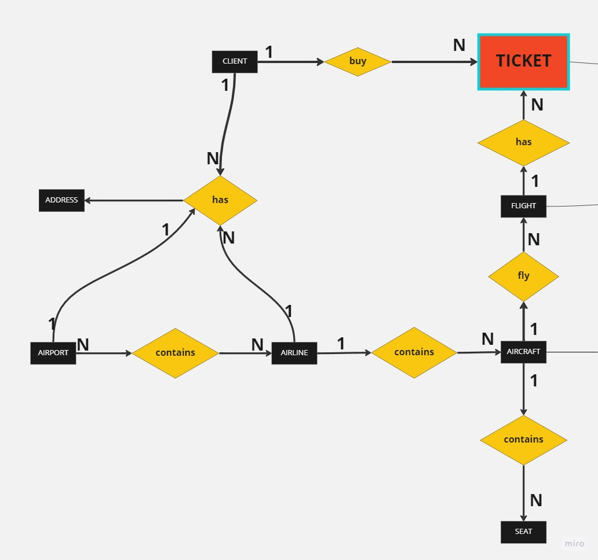

# Skypass Flights
Projeto Final START&lt;tech&gt;
 
| JAVA | MSSQLSERVER | SPRING BOOT | API |
 
Sistema JAVA sobre passagens aéreas

<a href="https://docs.google.com/document/d/1ElRBBApK8j2OIPLHJ2G7ijFpY8Qq2nvwOsQtGmz6KdQ/edit?usp=sharing">SKYPASS DOCUMENTAÇÃO</a>

<a href="https://docs.google.com/document/d/1nfFfXf5ALRQP5Y97zNybf7_1YFQM3KTI1khI3msPeog/edit?usp=sharing">ALGUNS EXEMPLOS DE DADOS JSON</a>

<a href="https://miro.com/welcomeonboard/REl6MnhVcmVKTDBERzVpVDRPWEJqSkM5WUh5UVRMU2VxM3UwYXZTbnYxT1lFb1BsT0xrWVI4ekM4OEREUGxvMHwzNDU4NzY0NTQ0MTc2MDgyOTcxfDI=?share_link_id=810734589044">FLUXOGRAMA - MIRO</a>

 # Autores

| [ ***Dener Rodrigo Corrêa***](https://github.com/DRC43) |  [ ***Philippe R. Bretas***](https://github.com/prbretas) |  [ ***Lucas Eduardo Ferreira***](https://github.com/Luxiosis) |
| :---: | :---: | :---: |
